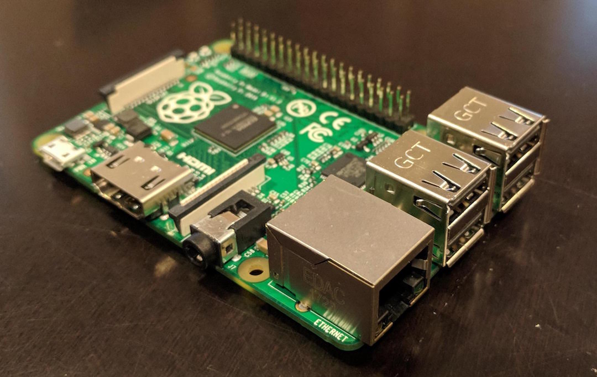
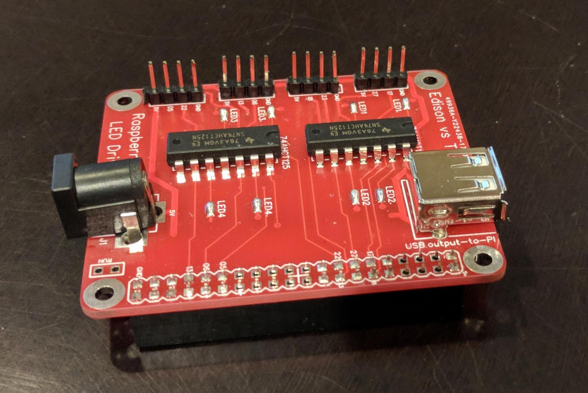
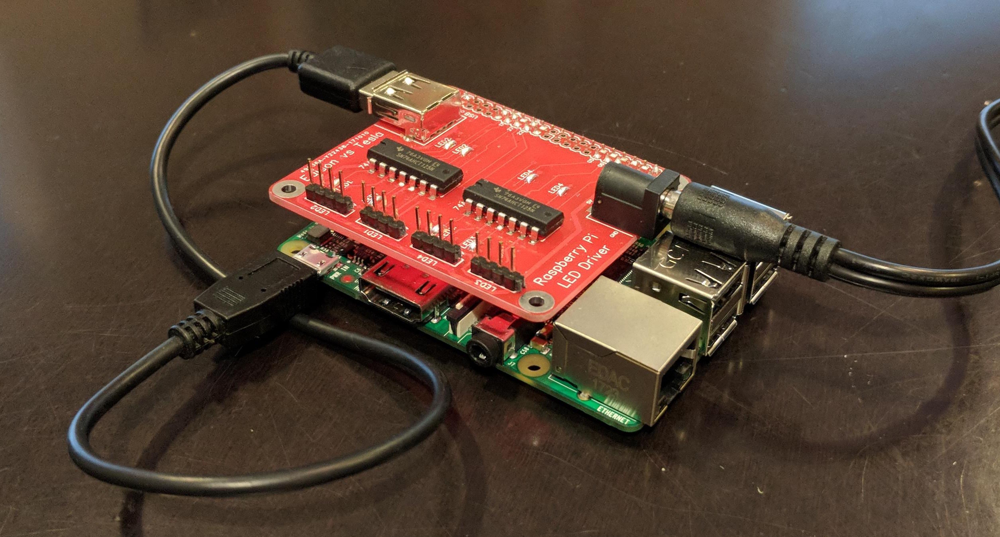
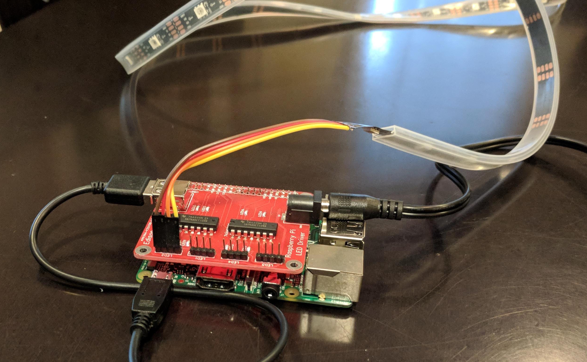

# Interactive LED Bridge
The Interactive LED Bridge lighting project was built with permission of the Atlanta Beltline Partnership (ABP) as part of an effort to promote art and public use of the Atlanta Beltline.  Located at the crossing of the Eastside Beltline trail and Edgewood Ave, the LED bridge serves as a piece of interactive art utilizing LED strip lighting that animates as people walk pass and under the bridge.

## Getting Started

These instructions will get you a copy of the project up and running on your local machine for development and testing purposes. See deployment for notes on how to deploy the project on a live system.

### Prerequisites

A Raspberry Pi is required for this application. Any version with a 40pin GPIO header would do.
The one used in this project is the version 3 Model B+ with <br> 1.4GHz 64-bit quad-core processor, dual-band wireless LAN, Bluetooth 4.2/BLE, faster Ethernet, and Power-over-Ethernet support (with separate PoE HAT).  This the latest revision of the third-generation single-board computer that came out March 2018.
<br><br><br>

Also needed is the Spark and Current Raspberry Pi shield for LED lighting.
<br><br><br><br><br><br><br><br>

In this next diagram, you can see the shield mounted on the Raspberry Pi with 5V power supplied to the barrel connector on the shield. The USB patch cable provides power to the Raspberry Pi from the USB port on the shield.
<br><br><br><br>
Connect the [Adafruit DotStar digital LED strip](https://www.adafruit.com/product/2238?length=1) to the shield like so.

<br><br><br><br><br><br>
### Installing

Here are step by step instructions on how to get your development environment running:

```
sudo apt-get update
sudo apt-get install git
git clone https://github.com/SparkandCurrent/RainbowBridge.git
cd RainbowBridge/
sudo python setup.py
sudo apt-get install python-dev
make
sudo python rainbow.py
```

You should see the colors animate on the LED strip cycling through all of the colors<br><br>

<br><br><br><br><br><br><br><br><br><br>


## Built With

- [Python](https://www.python.org/download/releases/2.7/) - The application framework used programming lights
- [Adafruit Dotstart](https://www.adafruit.com/product/2328) - Adafruit DotStar Digital LED Strip
- [Easyeda](https://easyeda.com) - Web-based electronic circuit design editor and PCB fulfillment service

## Contributing

Please read [CONTRIBUTING.md](https://gist.github.com/PurpleBooth/b24679402957c63ec426) for details on our code of conduct, and the process for submitting pull requests to us.

## Versioning

We use [SemVer](http://semver.org/) for versioning. For the versions available, see the [tags on this repository](https://github.com/your/project/tags).

## Contributors

Thanks goes to these wonderful people:

<!-- ALL-CONTRIBUTORS-LIST:START - Do not remove or modify this section -->
<!-- prettier-ignore -->
| [<br /><sub><b>Jason Hejna</b></sub>](http://www.jasonhejna.com/)<br /> | [<br /><sub><b>Derek Seaton</b></sub>](http://www.derekseaton.com/)<br />  |[<br /><sub><b>Bruce Nguyen</b></sub>](https://github.com/innoculou)<br />
| :---: | :---: | :---: | :---: | :---: | :---: | :---: |

<!-- ALL-CONTRIBUTORS-LIST:END -->

## License

This project is licensed under the MIT License - see the [LICENSE.md](LICENSE.md) file for details


